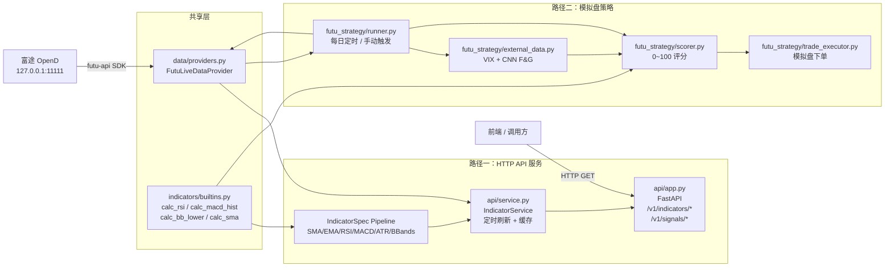

# TraderAnalysis 项目架构

> 最后更新：2026-04-14

量化分析平台，提供两条并行路径：**HTTP API 服务**（实时指标查询）和**模拟盘策略**（多指标评分 → 自动买入）。两条路径共享同一套数据层与指标计算层。

---

## 一、整体架构



---

## 二、项目结构

```
src/trader_analysis/
│
├── data/
│   ├── schemas.py              OHLCV 标准 schema（8个字段，统一小写）
│   └── providers.py            FutuLiveDataProvider（实时）
│                               CSVDataProvider / ParquetDataProvider（回测/开发）
│                               normalize_ohlcv()（所有数据源的统一归一化入口）
│
├── indicators/
│   ├── base.py                 IndicatorSpec / IndicatorRegistry / apply_indicators
│   └── builtins.py             ── 统一指标入口 ──
│                               calc_rsi / calc_macd_hist / calc_bb_lower / calc_sma
│                               （供评分系统和其他直接调用场景使用）
│                               ── IndicatorSpec 工厂 ──
│                               sma / ema / rsi / macd / atr / bbands
│                               （供 Strategy pipeline 使用）
│
├── signals/
│   ├── types.py                Signal / SignalSet / SignalType（BUY/SELL/HOLD）
│   └── rules.py                MovingAverageCrossRule / RSIReversalRule
│
├── strategy/
│   ├── strategy.py             Strategy（enrich → generate_signals）
│   └── examples.py             ma_cross / rsi_reversal 示例策略
│
├── backtest/
│   ├── engine.py               回测引擎
│   └── report.py               Sharpe / 最大回撤 / 胜率报告
│
├── api/
│   ├── service.py              IndicatorService（多 symbol 缓存 + 定时刷新）
│   └── app.py                  FastAPI 路由（/health /v1/indicators/* /v1/signals/*）
│
├── futu_strategy/              模拟盘策略子包
│   ├── config.py               所有可配置项（标的列表、仓位、阈值、日志路径等）
│   ├── data_fetcher.py         K 线拉取（日线 250 根 + 周线 60 根）+ 额度预检
│   ├── external_data.py        VIX（富途快照）+ CNN F&G（HTTP，模块级缓存）
│   ├── scorer.py               9 项指标评分，调用 indicators.calc_* 函数
│   ├── trade_executor.py       模拟盘限价单下单（含持仓检查）
│   ├── logger.py               评分 / 交易记录写入 JSONL 日志
│   ├── runner.py               主流程（连接复用 → 额度检 → 评分 → 交易）
│   └── __main__.py             python -m trader_analysis.futu_strategy 入口
│
├── notify/
│   └── wecom.py                企业微信通知（框架已有，待接入实时路径）
│
└── cli.py                      typer CLI 入口
```

---

## 三、数据层

### OHLCV 标准 Schema

所有数据源输出必须经过 `normalize_ohlcv()` 归一化：

| 字段 | 类型 | 说明 |
|------|------|------|
| `timestamp` | datetime | K 线时间 |
| `open / high / low / close` | float | 价格（前复权 QFQ） |
| `volume` | float | 成交量 |
| `symbol` | str | 标的代码，如 `US.AAPL` |
| `timeframe` | str | 周期，如 `1D` / `1W` |

### 数据源

| 类 | 用途 |
|----|------|
| `FutuLiveDataProvider` | 生产环境，通过 `OpenQuoteContext.request_history_kline` 实时拉取 |
| `CSVDataProvider` | 开发 / 回测，读取本地 CSV 文件 |
| `FutuJsonDataProvider` | 读取富途 API 脚本导出的 JSON 文件 |

---

## 四、指标层

`indicators/builtins.py` 是所有指标计算的**唯一入口**，分两套接口：

### calc_* 独立函数（直接返回 Series）

用于模拟盘策略评分、临时计算等场景：

```python
from trader_analysis.indicators import calc_rsi, calc_macd_hist, calc_bb_lower, calc_sma

rsi_series   = calc_rsi(close, period=14)
hist_series  = calc_macd_hist(close, fast=12, slow=26, signal=9)
lower_series = calc_bb_lower(close, period=20, std_mult=2.0)
ma200_series = calc_sma(close, period=200)
```

### IndicatorSpec 工厂（流水线风格）

用于 `Strategy` / `Backtest` pipeline，接受并返回完整 DataFrame：

```python
from trader_analysis.indicators import rsi, macd, bbands

strategy = Strategy(
    name="my_strategy",
    indicators=[rsi(14), macd(), bbands()],
    rule=RSIReversalRule(rsi_col="rsi_14"),
)
enriched_df = strategy.enrich(df)
```

---

## 五、模拟盘策略（futu_strategy）

### 5.1 评分权重

| # | 指标 | 分值 | 触发条件 |
|---|------|------|---------|
| 1 | 周线 RSI14 | 22 | `weekly_rsi < 30` |
| 2 | 日线 MACD 柱线底背离 | 16 | 价格新低但柱线未新低（最近 60 根）|
| 3 | VIX | 12 | `vix > 30` |
| 4 | 布林带下轨 | 10 | `close ≤ BB_lower × 1.02` |
| 5 | 日线 RSI14 | 10 | `daily_rsi < 30` |
| 6 | CNN Fear & Greed | 10 | `fg_score < 25` |
| 7 | 恐慌放量后缩量 | 8 | 近 20 日峰值量 > 均量 × 2，且近 3 日均量 < 峰值 × 0.6 |
| 8 | 价格偏离 MA200 | 6 | `(MA200 - close) / MA200 > 8%` |
| 9 | 周线 MACD 柱线缩小 | 6 | 柱线为负且绝对值收窄（空头动能减弱）|
| **合计** | | **100** | |

### 5.2 信号等级与仓位

| 总分 | 信号 | 操作 | 默认金额 |
|------|------|------|---------|
| ≥ 90 | `STRONG_BUY` | 模拟盘买入 | 2000 USD |
| 70~89 | `BUY` | 模拟盘买入 | 1000 USD |
| < 70 | `NO_ACTION` | 仅记录日志 | — |

金额在 `futu_strategy/config.py` 的 `POSITION_CONFIG` 中配置。

### 5.3 执行流程

```
runner.py 启动
 ├─ 创建 OpenQuoteContext + OpenSecTradeContext（全程复用，不在循环内重建）
 ├─ 获取模拟账户 acc_id（get_acc_list，过滤 SIMULATE，只取一次）
 ├─ 检查 K 线额度（需要 len(codes) × 2 个额度）
 ├─ 获取全局数据：VIX 快照 + CNN F&G（各只拉取一次）
 │
 └─ for each code in codes:
      ├─ 拉取日线 250 根 + 周线 60 根
      ├─ scorer.calculate_score() → {total_score, signal, breakdown}
      ├─ logger.log_score()
      └─ if signal in [BUY, STRONG_BUY]:
           ├─ get_market_snapshot() 获取当前价
           ├─ 计算 qty = int(amount / price)
           ├─ position_list_query(refresh_cache=True) 检查持仓
           ├─ place_order(TrdEnv.SIMULATE, OrderType.NORMAL)
           └─ logger.log_trade()
 │
 └─ quote_ctx.close() + trd_ctx.close()
```

### 5.4 运行方式

```bash
# 使用 config.py 中的 WATCHLIST
python -m trader_analysis.futu_strategy

# 指定标的
python -m trader_analysis.futu_strategy --codes US.AAPL US.TSLA HK.00700
```

定时调度（推荐时间：美股次日 06:00 北京时间，此时日线数据已稳定）：

```bash
# Linux/Mac crontab
0 6 * * * python -m trader_analysis.futu_strategy

# Windows 任务计划程序 → 每日 06:00 执行同等命令
```

### 5.5 日志格式

日志目录默认为项目根目录 `logs/`（可通过环境变量 `TA_LOG_DIR` 覆盖）。

**`score_log.jsonl`**（每次评分追加一行）：
```json
{
  "code": "US.AAPL", "total_score": 82, "signal": "BUY",
  "breakdown": { "weekly_rsi": {"score": 22, "value": 28.3, "triggered": true}, "..." },
  "timestamp": "2026-04-14 06:01:23"
}
```

**`trade_log.jsonl`**（每次下单追加一行）：
```json
{
  "code": "US.AAPL", "signal": "BUY", "score": 82,
  "qty": 6, "price": 168.5, "order_id": "7890123",
  "trd_env": "SIMULATE", "status": "success",
  "timestamp": "2026-04-14 06:01:25"
}
```

### 5.6 异常处理

| 异常场景 | 处理方式 |
|---------|---------|
| K 线额度不足 | 运行前统一检查，不足则整批退出并提示 |
| VIX 获取失败 | 该项计 0 分，继续评分，日志记录警告 |
| CNN F&G 超时 / 失败 | 该项计 0 分，继续评分，日志记录警告 |
| MACD 背离谷底不足 2 个 | 返回 False，该项计 0 分 |
| K 线根数 < 200（MA200） | 跳过 MA200 指标，计 0 分 |
| 已持有标的 | 下单前查持仓，已持有则跳过（`ALLOW_PYRAMID=False`） |
| 模拟账户余额不足 | 捕获异常，写日志，不中断其他标的 |
| OpenD 连接失败 | 启动时即失败退出，提示检查 OpenD 是否运行 |

---

## 六、HTTP API 服务

```bash
# 启动（通过环境变量配置数据源）
TA_DATA_PATH=examples/mock_futu_kline_HK.00700.json uvicorn trader_analysis.api.app:app

# 主要接口
GET /health
GET /v1/indicators/latest
GET /v1/indicators/history?limit=100
GET /v1/indicators/ma?timeframe=1D&period=200
GET /v1/signals/latest
```

---

## 七、关键约定

- **纯计算约束**：`indicators/`、`signals/`、`backtest/` 不依赖 I/O，只接收 DataFrame，保证单元测试和回测可独立运行。
- **统一数据归一化**：所有数据源（富途 API / CSV / JSON）必须通过 `normalize_ohlcv()` 处理后才能进入计算层。
- **统一指标入口**：所有指标数学逻辑只写一遍（`builtins.py` 内的 `_*_s` helpers），`calc_*` 函数和 `IndicatorSpec` 工厂均调用同一套实现，不重复代码。
- **OpenD 隔离**：`FutuLiveDataProvider` 是唯一依赖 `futu-api` 的 data 层模块；开发/测试环境用 `CSVDataProvider` 替代。
- **连接复用**：`OpenQuoteContext` 和 `OpenSecTradeContext` 在循环外创建，循环结束后统一关闭，禁止在循环内重建。
- **文档同步**：每次结构性变更（新增模块、接口变更、数据流调整）后，必须在同一次提交中更新本文件。

---

## 八、环境依赖

```bash
# 核心依赖（pyproject.toml 已声明）
pip install -e .

# 模拟盘策略额外依赖
pip install futu-api scipy requests

# 回测 Parquet 支持（可选）
pip install -e ".[parquet]"
```

前提条件：富途 OpenD 运行于 `127.0.0.1:11111`，已登录账号，模拟账户可用。
