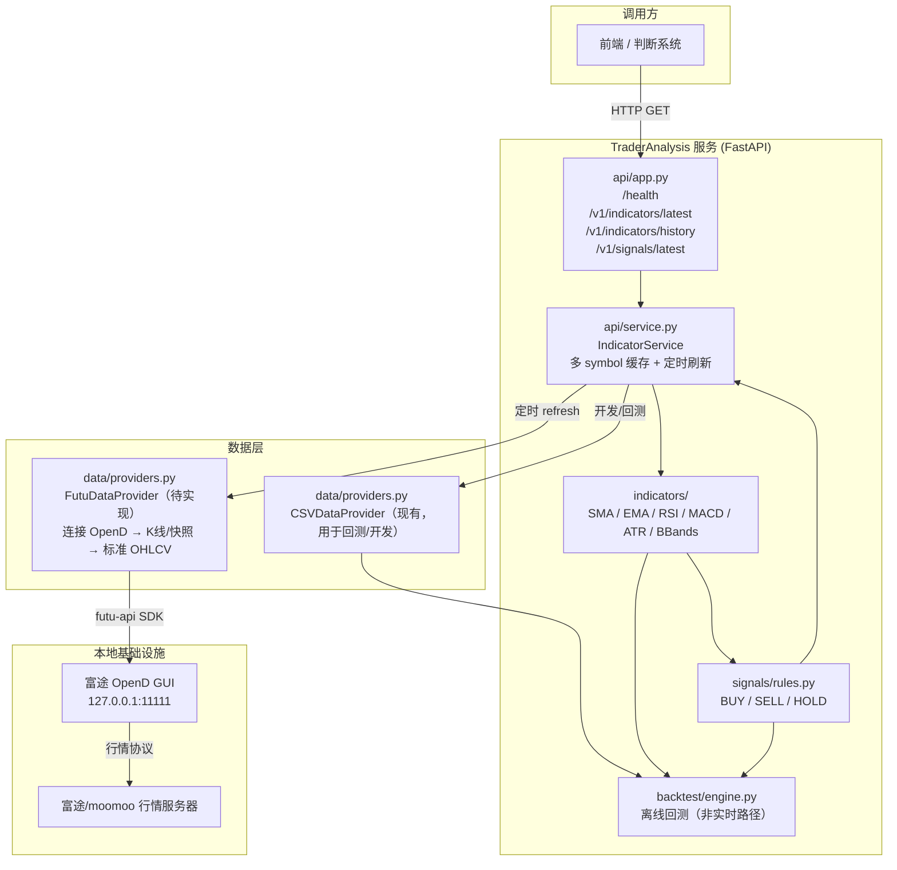

# 项目架构（TraderAnalysis）

> 最后更新：2026-03-28

本文记录仓库的模块边界、数据流与演进规划，**每次结构性变更后必须同步更新**。

---

## 一、目标架构

用户/前端通过 HTTP API 实时查询多标的技术指标与买卖信号。系统后台定时从富途 OpenD 拉取行情，在本地计算指标后缓存，接口直接读缓存返回，做到低延迟响应。

---

## 二、当前状态（2026-03-28）

| 模块 | 状态 | 说明 |
|------|------|------|
| `data/providers.py` CSVDataProvider | ✅ 完成 | 读 CSV/Parquet，规范化 OHLCV schema |
| `data/providers.py` FutuDataProvider | 🔲 待实现 | 连接 OpenD，支持多 symbol |
| `indicators/` SMA/EMA/RSI/MACD/ATR/BBands | ✅ 完成 | 纯函数，无 I/O 依赖 |
| `signals/rules.py` MA Cross / RSI Reversal | ✅ 完成 | 产出 BUY/SELL/HOLD |
| `backtest/` engine + report | ✅ 完成 | 离线回测，Sharpe/回撤/胜率 |
| `api/app.py` + `service.py` | ✅ 完成（单 symbol） | 目前读静态 CSV，需改造为多 symbol + Futu |
| `notify/` WeComWebhookNotifier | 🔲 框架存在，未接入实时路径 | |

---

## 三、近期演进计划

### 3.1 接入富途实时行情

**目标**：替换 `CSVDataProvider` 为 `FutuDataProvider`，实现实时多标的行情。

**依赖前提**：本地安装并运行富途 OpenD GUI（监听 `127.0.0.1:11111`），已安装 `futu-api` Python SDK。

**涉及文件**：

| 文件 | 变更内容 |
|------|----------|
| `data/providers.py` | 新增 `FutuDataProvider`：调用 `futu.OpenQuoteContext`，拉取 K 线，调用 `normalize_ohlcv()` 返回标准 DataFrame |
| `api/service.py` | `ServiceConfig` 新增 `symbols: list[str]`；`IndicatorService` 改为按 symbol 分别维护缓存 dict；`refresh_once()` 改为遍历所有 symbol |
| `api/app.py` | 接口新增 `symbols` query 参数，支持逗号分隔多标的；新增环境变量 `TA_FUTU_HOST`、`TA_FUTU_PORT`、`TA_SYMBOLS` |

**目标标的范围**：港股（`HK.*`）、美股（`US.*`），暂不支持 BTC 现货。

### 3.2 多策略支持（中期）

计划支持同一 symbol 并行运行多个策略，`/v1/signals/latest` 返回各策略结果聚合。

### 3.3 通知推送（待定）

`notify/WeComWebhookNotifier` 接入实时路径，在信号变化时推送企业微信。

---

## 四、关键约定

- **纯计算约束**：`indicators/`、`signals/`、`backtest/` 不依赖 I/O，只接收 DataFrame，便于单元测试与回测复用。
- **OHLCV 标准 schema**：`timestamp / open / high / low / close / volume / symbol / timeframe`（统一小写）。所有数据源必须通过 `normalize_ohlcv()` 后才能进入计算层。
- **信号完备性**：每根 bar 都产出一个信号（默认 HOLD），保证回测与实时路径完全对齐。
- **OpenD 依赖隔离**：`FutuDataProvider` 是唯一依赖 `futu-api` 的地方，开发/测试环境可用 `CSVDataProvider` 替代，服务启动时通过环境变量 `TA_DATA_SOURCE=futu|csv` 切换。
- **文档同步要求**：每次结构性变更（新增模块、接口变更、数据流调整）后，必须在同一 PR 内更新本文件。
